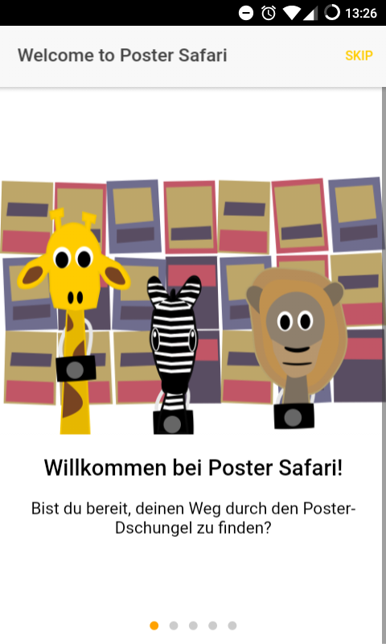
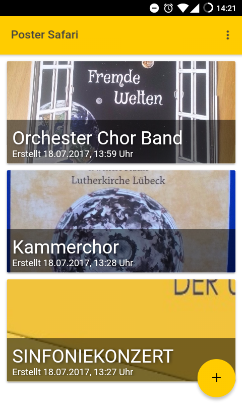
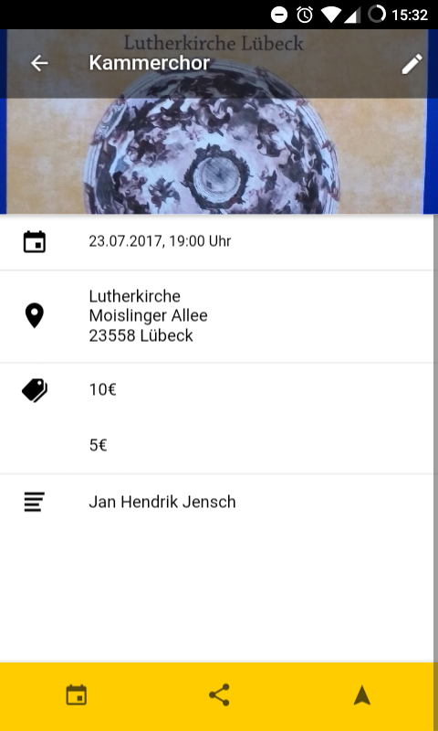
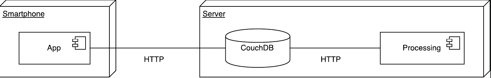

# Poster Safari

Smartphone app and server backend that extracts information from event posters

Poster Safari was developed as part of a case study at the University of Lübeck.

It is no longer under active development. 
However, whoever finds the app useful (and we are sure, somewhone does!) may ask to become a collaborator or just fork this repository and revive this project.

## App

## System overview 

